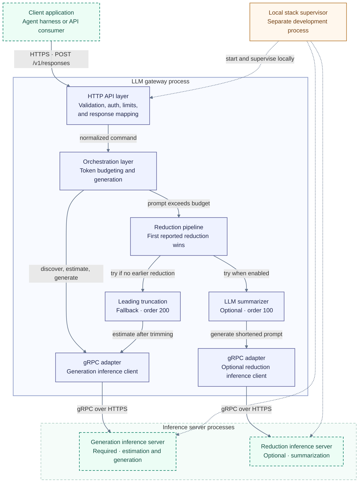

# Architecture

`gen-proxy` is a stateless LLM orchestration gateway between client applications or agent harnesses and one or two inference servers. The current integration uses `llama-runtime` over gRPC.

It validates Responses-style requests, normalizes input into a runtime prompt, estimates token fit, reduces oversized prompts when configured, calls the generation runtime, and returns a normalized Responses-style envelope.

Inference runs in separate server processes. Client applications and agent harnesses manage conversation state and any tool execution. The gateway validates and processes each request independently. Public request examples and configuration are in the [README](../README.md); planned work is in the [backlog](backlog.md).

## System diagram

Purple boxes show gateway code in this repository. Dashed green boxes show client applications and inference servers outside the gateway process. The orange box is the local stack supervisor. Solid arrows show calls; results return along the same paths. Dotted arrows show local startup and supervision. The local stack starts both inference servers; a separately configured gateway can disable the reduction inference server.

The service re-estimates the prompt after the pipeline returns. A reducer reporting a change ends the pipeline, so a summary that still exceeds budget fails with `422` without trying truncation afterward.

## Layers

| Project | Responsibility |
| --- | --- |
| `Backend/Api/Host` | Endpoint mapping, request validation and normalization, auth, rate limiting, middleware, OpenAPI, response mapping, and dependency setup. |
| `Backend/Api/Services/Contracts` | Response generation commands and results, prompt reduction interfaces, and service exceptions. |
| `Backend/Api/Services/Implementation` | Response generation orchestration, token budgeting, ordered prompt reduction, and response-format enforcement. |
| `Backend/Api/Integrations/Contracts` | Runtime client interfaces, runtime-facing models, integration exceptions, timeout options, and metrics. |
| `Backend/Api/Integrations/Implementation` | `llama-runtime` gRPC transport and adapters for capability discovery, token estimation, generation, and runtime errors. |

The Host references service contracts and both implementation projects to wire dependencies. Service implementations depend on service contracts and integration contracts. Integration implementations depend on integration contracts. Services call runtime interfaces; gRPC and protobuf details stay in integration implementations.

### Architecture conventions

- Host namespaces mirror the folder layout for `Endpoints`, `Middleware`, `Security`, `Validation`, and `Configurations`.
- Setup modules stay under `Backend/Api/Host/Configurations` and wire the composition root. Business logic belongs in Services; runtime-specific behavior belongs in Integrations.
- Reducers declare execution order through `IPromptReducer.Order`. Lower values run first.
- `Backend/GenProxy.sln` contains the API projects and their unit and integration tests. These tests provide focused coverage and run in CI.

The local stack runner under `Backend/Tools/GenProxy.StackRunner` manages development and smoke runs. It is built separately when running `make stack-run`, `make smoke`, or `make smoke-budget`. API projects and API tests do not reference the tool. Real-inference smoke checks supplement unit and integration coverage.

## Request lifecycle

- `POST /v1/responses` accepts a Responses-compatible request body.
- Validation enforces the current API boundary: a required `model`, exactly one structured user message, one or more `input_text` content parts, supported response formats, request limits, and rejected unsupported fields.
- `ResponseCreateRequestMapper` joins valid input text parts with newlines into a deterministic prompt.
- `ResponseGenerationService` creates a response id, records request metrics, checks required runtime capabilities for JSON schema output, and estimates token usage before generation.
- The generation runtime is called through `IGenerationRuntimeClient`.
- The runtime response is wrapped into the public Responses-style shape by `ResponsesFactory`.

The requested `model` tags request logs and metrics but does not choose a runtime. The returned model name comes from the generation runtime, with the requested value as a fallback. Input usage comes from the runtime when available, otherwise from the final token estimate. Output and total usage come from the runtime when available. `metadata` does not affect runtime behavior.

## Prompt budgeting and reduction

- `ResponseGenerationService` estimates tokens against the configured generation runtime before generation. The estimate supplies context size, reserved output tokens, maximum allowed input tokens, and fit status.
- If the prompt fits, generation proceeds without reduction.
- If the prompt does not fit, the prompt reduction pipeline runs ordered reducers.
- `LlmPromptSummarizer`, order `100`, uses the prompt-reducer runtime when `PromptReducerRuntime:Enabled` is true. Its configured template substitutes `{{prompt}}` and `{{max_tokens}}` before calling the runtime.
- `LeadingPromptTruncator`, order `200`, removes text from the start of the prompt and repeats generation-runtime estimation until the remaining prompt fits or is empty. When the reducer runtime is disabled, this is the only reducer.
- Leading truncation cuts at Unicode scalar boundaries so it does not split UTF-16 surrogate pairs.
- Empty or whitespace-only summaries leave the original prompt unchanged so fallback can run. If reduction leaves no non-whitespace input, the service returns `422` before re-estimation or generation.
- After a reducer reports a reduction, the service re-estimates the reduced prompt.
- The pipeline stops at the first reducer that reports a reduction. If the reduced prompt still does not fit after service re-estimation, the request fails with `422` without continuing to later reducers.
- Summarizer runtime availability failures leave the original prompt available for fallback. A runtime prompt-budget failure propagates as `422`.
- Cancellation stops reduction before another reducer can run. Reducer deadlines remain timeout failures and return `504`, rather than becoming prompt-reduction failures with `502`.

## Runtime contract

- Gen Proxy requires one generation `llama-runtime` gRPC service.
- Gen Proxy may use a second prompt-reducer runtime for prompt summarization.
- Runtime addresses are configured with `GenerationRuntime:*` and `PromptReducerRuntime:*` options and must use HTTPS when enabled.
- Each runtime can receive its own outbound `x-api-key`; public API keys and runtime keys are separate settings.
- The gRPC client supports `EstimateTokens`, `GetCapabilities`, and `Generate`.
- Runtime clients own their gRPC channels and outbound HTTP clients. Disposing the Host service provider releases those resources.
- Each call sends a runtime-specific deadline. `Timeouts:EstimateTokens` and `Timeouts:GetCapabilities` default to 10 seconds; `Timeouts:Generate` defaults to 120 seconds. The Host also applies `ResponsesTimeout:Timeout`, a 180-second limit for the complete request. Runtime deadlines and the overall timeout return `504`; client cancellation propagates to upstream calls.
- The overall timeout covers capability discovery, estimation, reduction, and generation. ASP.NET Core disables that timeout while a debugger is attached; gRPC deadlines still apply.
- `response_format.type=json_schema` requires generation runtime structured JSON output capability support before generation and is translated to the `llama-runtime v0.7.1` `json` response format with the raw schema payload.
- Schema responses must include runtime trace metadata showing structured output was applied and satisfied, and the generated content must parse as a JSON object.
- The runtime validates its supported JSON Schema subset. Gen Proxy checks the runtime trace and JSON object output; it does not independently validate the generated object against the complete schema.
- `Internal` runtime errors carrying `runtime-error-code=structured_output_failed` return `502` even when their diagnostic messages differ.
- Request-level generation options are forwarded to the runtime; support for `temperature`, `top_p`, and `max_output_tokens` is runtime-defined.
- The local `v0.7.1` stack uses greedy generation defaults. Gen Proxy rejects `max_output_tokens` unless it equals the output budget reported by token estimation, corresponding to `Llama:Native:GenerationMaxNewTokens`. The local default is `512`.

Capability discovery currently runs within JSON schema requests. There is no capability cache, runtime registry, or multi-runtime generation routing; those remain backlog items.

## Security, observability, and failures

- Protected requests require the exact API key in `X-API-Key`.
- `Authorization` headers and bearer prefixes are not accepted.
- Development can explicitly opt out of API-key requirements.
- Requests are rate limited by API key or client address.
- The request body limit applies to every accepted Responses route, including trailing slashes, before JSON binding. It covers both Content-Length and chunked bodies. Normalized input size is checked before service execution.
- For HTTP/1.1 chunked requests, Kestrel counts chunk framing toward the body limit, so the JSON payload must leave room for that framing.
- HTTP request and response body logging is disabled by default. `ResponsesLogging:LogBodies=true` enables it globally, with a 4096-byte limit per body. Normal service logs record identifiers, model names, reduction strategy, token counts, and timing without prompt or completion text.
- Upstream runtime failures are normalized into HTTP problem responses.
- OpenAPI/Swagger is available in Development and documents the current Responses API wire shape.

## Local stack

The Makefile is the entry point for local API runs and full-stack smoke checks. `GenProxy.StackRunner` supervises separate runtime and API processes; it does not participate in production request handling. CI restores, builds, and tests the API solution. Tagged releases publish a self-contained macOS ARM64 binary. CI and release packaging do not use Docker.

### Startup and shutdown

1. For smoke runs, the runner refuses to start if an active or unverified tracked process record exists. Interactive `stack-run` stops previously tracked processes after verifying their identity.
2. It downloads and caches `llama-runtime` release artifacts in `.runtime-cache/`. The default version is `v0.7.1` unless `LLAMA_RUNTIME_VERSION` is set explicitly.
3. It checks the ASP.NET Core development certificate, then starts the generation runtime on `https://localhost:50051` and summarizer runtime on `https://localhost:50052`. Runtime logs go to `.runtime-logs/`; process records and runtime state go to `.runtime-run/`.
4. It waits for runtime readiness and a short stability window, then builds the API and runs its assembly with `dotnet` on `https://localhost:7001`. The API build drains stdout and stderr while it runs.
5. It supervises the running stack. An unexpected runtime exit fails the stack and stops the remaining managed processes. Exit, interruption, and startup failure also stop the API and both runtimes.

The API build runs in a private process group whose launcher stays alive until cleanup. Canceling startup stops that group, including children that outlive the build process, before stack cleanup completes. Ports and startup timeouts can be overridden through the [local settings in the README](../README.md#local-overrides).

### Process ownership

Files in `.runtime-run/` with a `.pid` extension contain JSON with the process ID, UTC start time, and executable path. The runner writes these records atomically and verifies all three fields before stopping a process. It rechecks identity before escalating to a forced stop.

Legacy PID-only files and invalid or mismatched records do not prove ownership. The runner discards them without stopping the referenced process. Processes left running by an older runner may therefore need manual cleanup before restart. Parallel stacks need separate checkouts and distinct runtime ports and API URLs.

### Smoke suites and demo helper

- `make smoke` refuses to replace an existing tracked stack and uses the basic suite for generation, minimal JSON schema output, auth, and invalid-request checks.
- `make smoke-budget` uses only the oversized-prompt `422` scenario. It constrains the generation context while leaving the summarizer a larger context.
- Direct `smoke all` runs both suites with a fresh stack for each suite.
- `make demo` wraps `scripts/demo-request.sh` to send requests to an existing stack. It does not start processes or wait for readiness. Prompt text passes through an environment variable so make and the shell do not interpret it as command text.

The demo helper's `--json` option changes only `response_format` to a minimal schema requiring a string `answer` field. It sends the original user prompt. Usage examples remain in the [README](../README.md#manual-demo).
